# Despliegue de una aplicación Python con Flask y Gunicorn

**Alumno:** Antonio Benitez Garcia  
**Módulo:** Despliegue de Aplicaciones Web  
**Curso:** 2025-2026

---

## 1. Introducción

En esta práctica se documenta el proceso completo de despliegue de una aplicación web basada en Python (Flask) sobre una máquina virtual Debian. El objetivo es configurar un entorno de producción profesional utilizando **Gunicorn** como servidor de aplicaciones WSGI y **Nginx** como proxy inverso, finalizando con un despliegue real desde un repositorio de GitHub.

---

## 2. Preparación del Entorno

### Instalación de Paquetes
El primer paso es la actualización de repositorios y la instalación de las herramientas necesarias: Nginx, Gunicorn, Pipenv y Git, así como el entorno de Python.

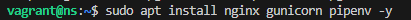
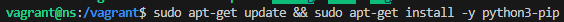

Verificamos las versiones para asegurar que el sistema está listo:

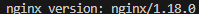

### Configuración de Directorios y Permisos
Creamos el directorio de la aplicación y ajustamos los permisos para el usuario `vagrant` y el grupo `www-data`.

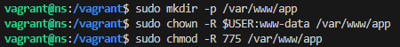

---

## 3. Configuración del Entorno Virtual

### Inicialización y Dependencias
Dentro del directorio del proyecto, instalamos las dependencias (`flask` y `gunicorn`) y activamos el entorno virtual.

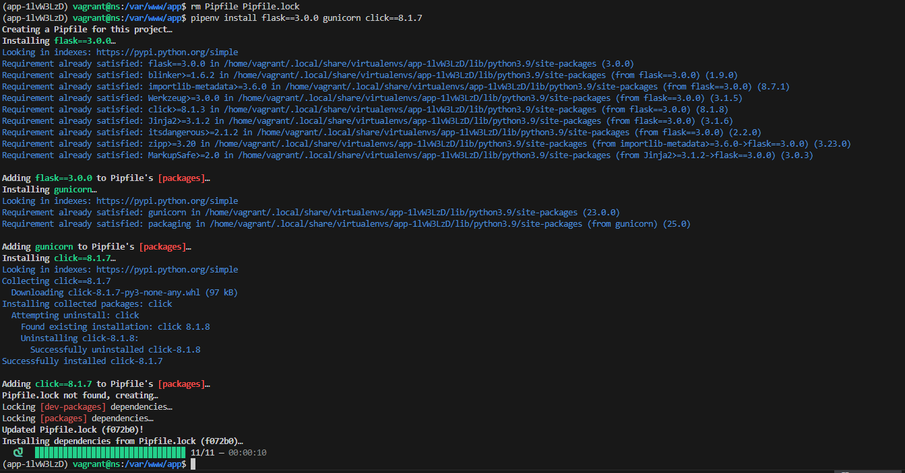
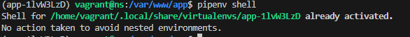

---

## 4. Creación de la Aplicación y Archivos de Configuración

Creamos y editamos los archivos esenciales: el archivo de entorno `.env`, la aplicación (`application.py`) y el punto de entrada (`wsgi.py`).

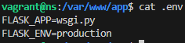

**Código de la Aplicación:**

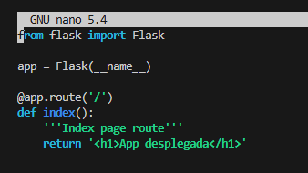

**Punto de Entrada (WSGI):**

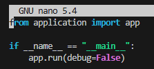

### Prueba de Desarrollo
Antes de configurar el servidor de producción, verificamos que la aplicación arranca correctamente en modo desarrollo.

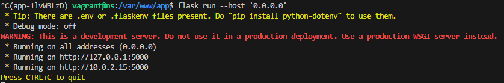

---

## 5. Configuración de Gunicorn (Servidor de Aplicaciones)

Comprobamos que Gunicorn funciona manualmente y localizamos su ruta de instalación dentro del entorno virtual.

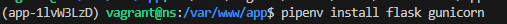
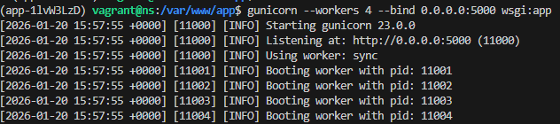
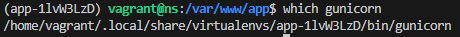

### Automatización con Systemd
Creamos un servicio del sistema para que la aplicación se ejecute automáticamente en segundo plano.

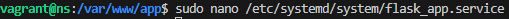
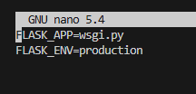

---

## 6. Configuración de Nginx (Proxy Inverso)

Configuramos Nginx para redirigir el tráfico del puerto 80 al socket de nuestra aplicación Flask.

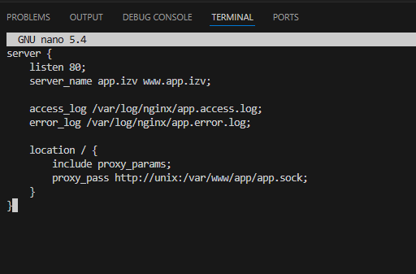

Reiniciamos el servicio y comprobamos su estado:

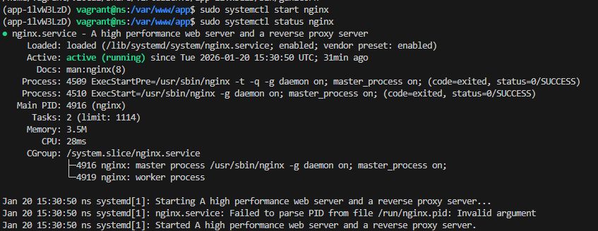

### Comprobación del Despliegue Manual
Accedemos desde el navegador para verificar que la aplicación "Hola Mundo" se ha desplegado correctamente.

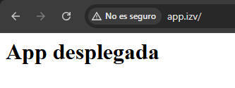

---

## 7. Despliegue Final: Repositorio GitHub

Como tarea de ampliación, realizamos el despliegue de una aplicación real clonada desde un repositorio externo ("msdocs-python-flask-webapp-quickstart").

### Clonado y Dependencias
Clonamos el repositorio y preparamos el entorno.

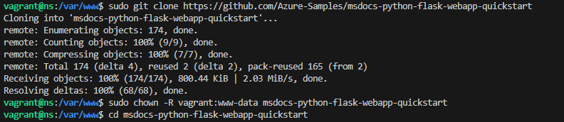
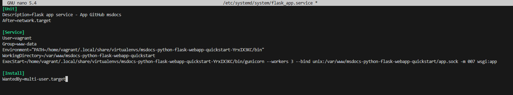

### Resultado Final
Tras reconfigurar los servicios para apuntar a la nueva carpeta, la aplicación de Microsoft Azure carga correctamente, mostrando la pantalla de bienvenida y el funcionamiento tras el login.

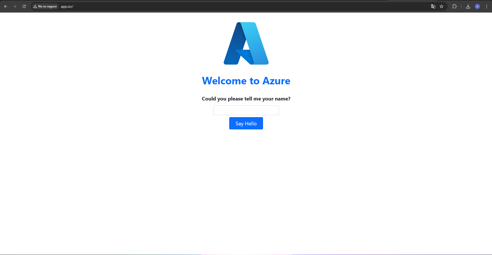

