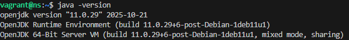
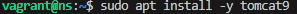
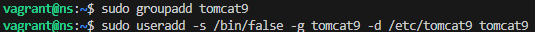
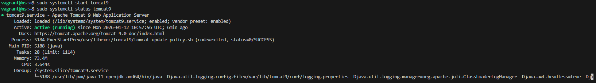
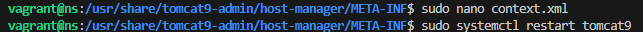
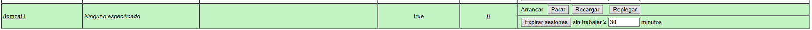
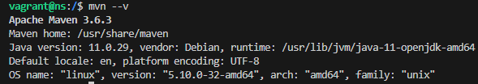
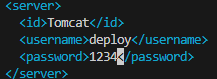
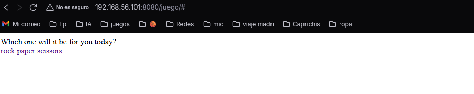

# Despliegue de Aplicaciones Java en Apache Tomcat con Maven

**Alumno:** Antonio Benitez Garcia

**Módulo:** Despliegue de Aplicaciones Web

**Curso:** 2025-2026

---

## 1. Introducción

En esta práctica se documenta el proceso completo de configuración de un servidor de aplicaciones Apache Tomcat sobre una máquina virtual Debian. El objetivo es realizar dos tipos de despliegues: uno manual mediante la interfaz gráfica y otro automatizado utilizando Maven para la aplicación "Rock-Paper-Scissors".

---

## 2. Preparación del Entorno

### Instalación de Java y Tomcat
El primer paso es la instalación del Kit de Desarrollo de Java (OpenJDK) y el servidor Tomcat 9.

### Creación de Usuarios del Sistema
Por seguridad, creamos un grupo y usuario específico para ejecutar el servicio.

Verificamos que el servicio está activo:

---

## 3. Configuración de Acceso Remoto y Paneles

### Habilitar Acceso Remoto
Editamos el archivo `context.xml` para permitir conexiones desde fuera de `localhost` y reiniciamos el servicio.

### Usuarios de Administración
Configuramos el archivo `tomcat-users.xml` asignando los roles `manager-gui` y `manager-script` al usuario "alumno".

---

## 4. Despliegue Manual mediante GUI

Antes de usar Maven, realizamos un despliegue manual para verificar el funcionamiento del gestor de aplicaciones. 

1. Accedemos al **Manager App**.
2. En la sección "Desplegar", seleccionamos el archivo `.war` local (`tomcat1.war`) y pulsamos desplegar.

Como se observa en la siguiente captura, la aplicación `/tomcat1` aparece correctamente listada en la tabla de aplicaciones y su estado es `Running: true`.

*(Nota: Esta captura demuestra que el despliegue manual se realizó con éxito y el servidor está listo para servir aplicaciones)*.

---

## 5. Configuración de Maven y Despliegue de Prueba

Instalamos Maven y configuramos las credenciales del servidor en el archivo `settings.xml` (o configuración del plugin) para permitir la automatización.

Generamos y desplegamos una aplicación básica ("Hola Mundo") para probar la conexión entre Maven y Tomcat.

---

## 6. Despliegue Final Automatizado: Rock-Paper-Scissors

Para la tarea final, desplegamos la aplicación "Rock-Paper-Scissors" siguiendo estos pasos:

1.  Clonado del repositorio GitHub y cambio a la rama `patch-1`.
2.  Configuración del `pom.xml` añadiendo el plugin `tomcat7-maven-plugin`.
3.  Ejecución del comando: `mvn tomcat7:deploy`.

### Comprobación Final

Accedemos a la ruta desplegada (`/juego`) desde el navegador. La aplicación carga correctamente, mostrando la interfaz del juego "Roshambo", lo que confirma que el despliegue automatizado ha funcionado.

